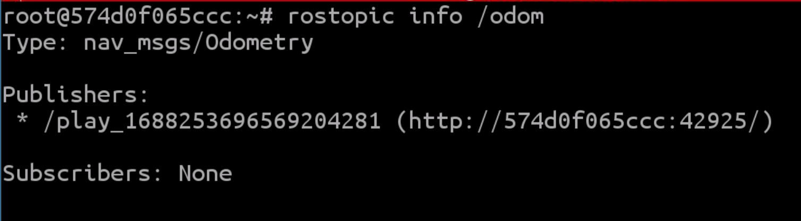
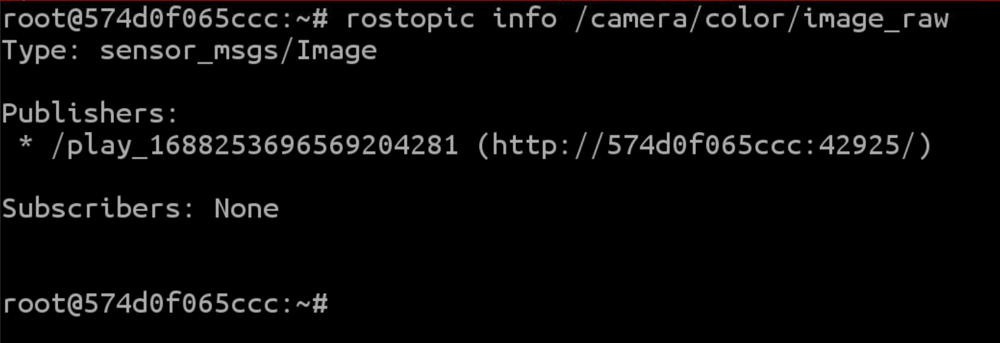
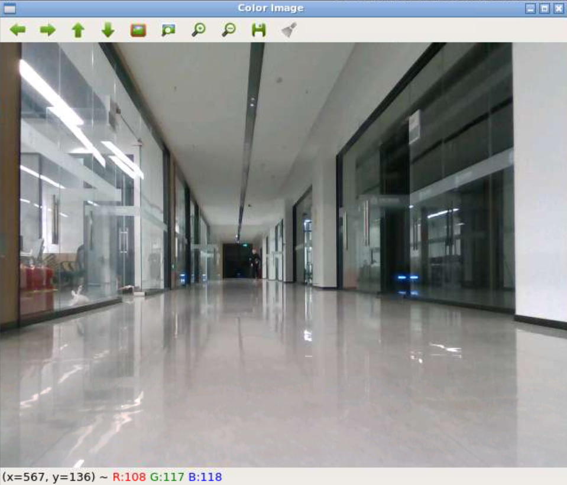
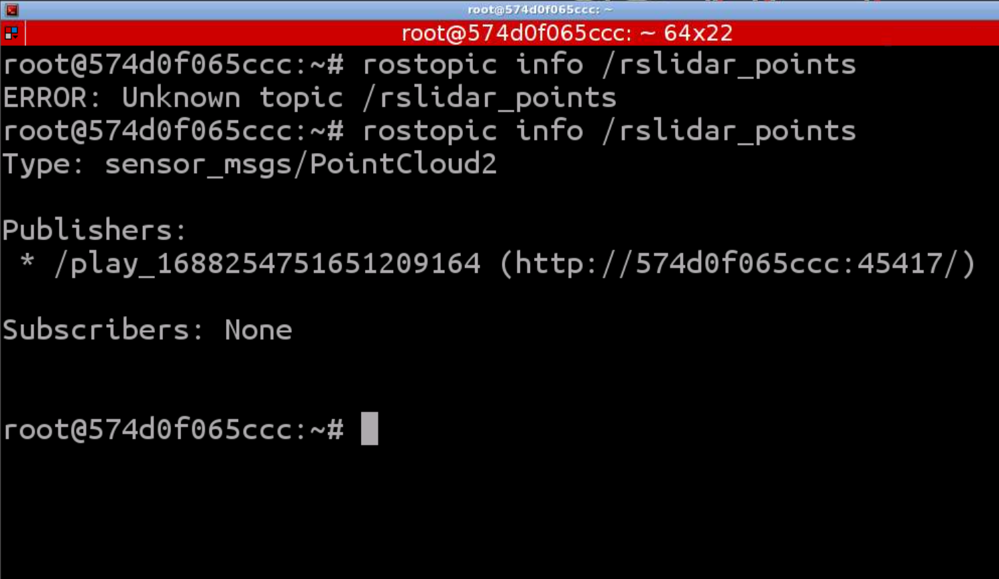
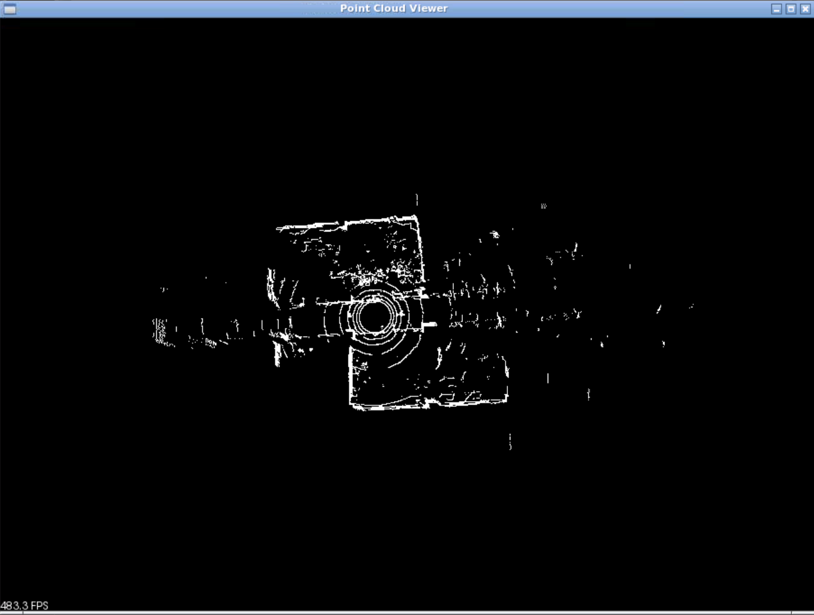

# ROS数据展示系统

## 一、 用命令行窗口显示小车的IMU和里程计（odometry）数据
### 1. imu_topic
* `rosbag play all.bag`播放数据包数据
* `rostopic list`查看现有topic\
  
* `rostopic info /imu/data_raw`查看消息类型\
  
* `rosmsg show snesor_msgs/Imu`查看消息内容\
  
* 编写`imu_topic`订阅函数
  ```C++
    #include <iostream>
    #include <ros/ros.h>
    #include <sensor_msgs/Imu.h>

    void imuCallback(const sensor_msgs::Imu::ConstPtr& msg)
    {
        // 处理IMU数据，这里只是简单地打印数据到命令行
        std::cout<<"Received Header data: "<<std::endl;
        std::cout << "    uint32 seq: " << msg->header.seq << std::endl;
        std::cout << "    time stamp: " << msg->header.stamp << std::endl;
        std::cout << "    string frame_id: " << msg->header.frame_id << std::endl;
        std::cout<<"Received IMU data: orientation (x, y, z)"<<std::endl;
        std::cout << "    float64 x: " << msg->orientation.x << std::endl;
        std::cout << "    float64 y: " << msg->orientation.y << std::endl;
        std::cout << "    float64 z: " << msg->orientation.z << std::endl;
        std::cout << "    float64 w: " << msg->orientation.w << std::endl;
        std::cout<<"Received IMU data: angular velocity (x, y, z)"<<std::endl;
        std::cout << "    float64 x: " << msg->angular_velocity.x << std::endl;
        std::cout << "    float64 y: " << msg->angular_velocity.y << std::endl;
        std::cout << "    float64 z: " << msg->angular_velocity.z << std::endl;
        std::cout<<"Received IMU data: linear acceleration (x, y, z)"<<std::endl;
        std::cout << "    float64 x: " << msg->linear_acceleration.x << std::endl;
        std::cout << "    float64 y: " << msg->linear_acceleration.y << std::endl;
        std::cout << "    float64 z: " << msg->linear_acceleration.z << std::endl;
    }

    int main(int argc, char** argv)
    {
        ros::init(argc, argv, "imu_topic");  // 初始化ROS节点
        ros::NodeHandle nh;  // 创建节点句柄

        // 创建订阅器，订阅IMU和里程计主题
        ros::Subscriber imu_sub = nh.subscribe("/imu/data_raw", 1000, imuCallback);

        ros::spin();  // 循环等待接收ROS消息

        return 0;
    }
  ```
* 运行结果\
  

### 2. odom_topic
* `rostopic info /odom`查看消息类型\
  
* `rosmsg show nav_msgs/Odometry`查看消息内容\
  
* 编写`odom_topic`订阅函数
  ```C++
    #include <iostream>
    #include <ros/ros.h>
    #include <nav_msgs/Odometry.h>

    void imuCallback(const nav_msgs::Odometry::ConstPtr& msg)
    {
        // 处理IMU数据，这里只是简单地打印数据到命令行
        std::cout<<"Received Header data: "<<std::endl;
        std::cout << "    uint32 seq: " << msg->header.seq << std::endl;
        std::cout << "    time stamp: " << msg->header.stamp << std::endl;
        std::cout << "    string frame_id: " << msg->header.frame_id << std::endl;
        std::cout<<"Received ODOM data: Point point (x, y, z)"<<std::endl;
        std::cout << "    float64 x: " << msg->pose.pose.position.x << std::endl;
        std::cout << "    float64 y: " << msg->pose.pose.position.y << std::endl;
        std::cout << "    float64 z: " << msg->pose.pose.position.z << std::endl;
        std::cout<<"Received ODOM data: Quaternion orientation (x, y, z, w)"<<std::endl;
        std::cout << "    float64 x: " << msg->pose.pose.orientation.x << std::endl;
        std::cout << "    float64 y: " << msg->pose.pose.orientation.y << std::endl;
        std::cout << "    float64 z: " << msg->pose.pose.orientation.z << std::endl;
        std::cout << "    float64 w: " << msg->pose.pose.orientation.w << std::endl;
        std::cout<<"Received ODOM data: linear (x, y, z)"<<std::endl;
        std::cout << "    float64 x: " << msg->twist.twist.linear.x << std::endl;
        std::cout << "    float64 y: " << msg->twist.twist.linear.y << std::endl;
        std::cout << "    float64 z: " << msg->twist.twist.linear.z << std::endl;
        std::cout<<"Received ODOM data: angular (x, y, z)"<<std::endl;
        std::cout << "    float64 x: " << msg->twist.twist.angular.x << std::endl;
        std::cout << "    float64 y: " << msg->twist.twist.angular.y << std::endl;
        std::cout << "    float64 z: " << msg->twist.twist.angular.z << std::endl;
    }

    int main(int argc, char** argv)
    {
        ros::init(argc, argv, "odom_topic");  // 初始化ROS节点
        ros::NodeHandle nh;  // 创建节点句柄

        // 创建订阅器，订阅IMU和里程计主题
        ros::Subscriber odom_sub = nh.subscribe("/odom", 1000, imuCallback);

        ros::spin();  // 循环等待接收ROS消息

        return 0;
    }

  ```
* 运行结果\
  

## 二、 用图形界面显示颜色相机和深度相机的数据（利用OpenCV库）
### 1. color_image
* 安装openCV库
  ```C++
  sudo apt-get update
  sudo apt-get install libopencv-dev
  ```
* `rostopic info /camera/color/image_raw`查看消息类型\
  
* 编写`color_image`订阅函数
  ```C++
    #include <ros/ros.h>
    #include <sensor_msgs/Image.h>
    #include <cv_bridge/cv_bridge.h>
    #include <opencv2/opencv.hpp>

    cv::Mat colorImage;  // 存储颜色相机图像的全局变量

    void colorImageCallback(const sensor_msgs::ImageConstPtr& msg)
    {
    // 将ROS图像消息转换为OpenCV图像
    try
    {
        colorImage = cv_bridge::toCvCopy(msg, sensor_msgs::image_encodings::BGR8)->image;
    }
    catch (cv_bridge::Exception& e)
    {
        ROS_ERROR("cv_bridge exception: %s", e.what());
    }
    }


    int main(int argc, char** argv)
    {
    ros::init(argc, argv, "color_image");
    ros::NodeHandle nh;

    ros::Subscriber colorImageSub = nh.subscribe("/camera/color/image_raw", 1000, colorImageCallback);

    cv::namedWindow("Color Image");

    ros::Rate loop_rate(10);

    while (ros::ok())
    {
        ros::spinOnce();

        // 显示颜色相机图像
        if (!colorImage.empty())
        {
        cv::imshow("Color Image", colorImage);
        }

        cv::waitKey(1);
        loop_rate.sleep();
    }

        return 0;
    }
  ```
* 运行结果\
  

### 2. depth_image
* `rostopic info /camera/depth/image_rect_raw`查看消息类型\
  
* 编写`depth_image`订阅函数
  ```C++
    #include <ros/ros.h>
    #include <sensor_msgs/Image.h>
    #include <cv_bridge/cv_bridge.h>
    #include <opencv2/opencv.hpp>
    cv::Mat depthImage;  // 存储深度相机图像的全局变量


    void depthImageCallback(const sensor_msgs::ImageConstPtr& msg)
    {
    // 将ROS图像消息转换为OpenCV图像
    try
    {
        depthImage = cv_bridge::toCvCopy(msg, sensor_msgs::image_encodings::TYPE_32FC1)->image;
    }
    catch (cv_bridge::Exception& e)
    {
        ROS_ERROR("cv_bridge exception: %s", e.what());
    }
    }

    int main(int argc, char** argv)
    {
    ros::init(argc, argv, "depth_image");
    ros::NodeHandle nh;

    ros::Subscriber depthImageSub = nh.subscribe("/camera/depth/image_rect_raw", 1000, depthImageCallback);

    cv::namedWindow("Depth Image");

    ros::Rate loop_rate(10);

    while (ros::ok())
    {
        ros::spinOnce();

        // 显示深度相机图像
        if (!depthImage.empty())
        {
        cv::imshow("Depth Image", depthImage);
        }

        cv::waitKey(1);
        loop_rate.sleep();
    }

        return 0;
    }
  ```
* 运行结果\
  
## 三、 用图形界面显示激光雷达的点云数据（利用PCL库）
* 安装PCL库
  ```C++
  sudo apt-get install libpcl-dev
  ```
* `rostopic info /rslidar_points`查看消息类型\
  
* 编写`point_cloud`订阅函数
  ```C++
    #include <ros/ros.h>
    #include <sensor_msgs/PointCloud2.h>
    #include <pcl/point_cloud.h>
    #include <pcl_conversions/pcl_conversions.h>
    #include <pcl/visualization/pcl_visualizer.h>

    pcl::visualization::PCLVisualizer::Ptr viewer(new pcl::visualization::PCLVisualizer("Point Cloud Viewer"));
    pcl::PointCloud<pcl::PointXYZ>::Ptr cloud(new pcl::PointCloud<pcl::PointXYZ>);

    void cloudCallback(const sensor_msgs::PointCloud2ConstPtr& cloud_msg)
    {
        // 将ROS消息的点云数据转换为PCL格式
        pcl::fromROSMsg(*cloud_msg, *cloud);

        // 更新点云数据并刷新可视化界面
        viewer->updatePointCloud(cloud, "cloud");
        viewer->spinOnce();
    }

    int main(int argc, char** argv)
    {
        // 初始化ROS节点
        ros::init(argc, argv, "pcl_display_node");
        ros::NodeHandle nh;

        // 创建PCL可视化器
        viewer->setBackgroundColor(0.0, 0.0, 0.0);

        // 创建一个空的点云，并添加到可视化器中进行显示
        viewer->addPointCloud<pcl::PointXYZ>(cloud, "cloud");

        // 订阅点云数据的话题，并设置回调函数
        ros::Subscriber sub = nh.subscribe("/rslidar_points", 1000, cloudCallback);

        // 开始自循环（等待和处理ROS消息）
        ros::spin();

        return 0;
    }
  ```
* 运行结果\
 

 ## 四、利用SLAM的Gmapping算法构建地图
 * 下载Gmapping库
    ```
      sudo apt-get update
      sudo apt-get install ros-kinetic-gmapping
    ```
* 编写`map_build`订阅函数
  ```C++
  #include <iostream>
  #include <thread>
  #include <opencv2/opencv.hpp>
  #include "ros/ros.h"
  #include "nav_msgs/OccupancyGrid.h"

  void callback(const nav_msgs::OccupancyGrid::ConstPtr& ptr)
  {   
      std::cout << "resolution: " << ptr->info.resolution << std::endl;
      std::cout << "width: " << ptr->info.width << std::endl;
      std::cout << "height: " << ptr->info.height << std::endl;
      double scale = 1.0;
      int width = 1200;
      int height = 1200;
      cv::Point offset = {-1600, -1600};
      cv::Mat map = cv::Mat::zeros(cv::Size(width, height), CV_8UC3);
      for (int i = 0; i < ptr->info.width * ptr->info.height; ++i) {
          int x = (i % ptr->info.width + offset.x) * scale, y = (i / ptr->info.width + offset.y) * scale;
          if (ptr->data[i] == -1) {
              cv::circle(map, cv::Point(x, y), 1, cv::Scalar(255, 255, 255), -1);
          } else if (ptr->data[i] >= 80) {
              cv::circle(map, cv::Point(x, y), 3, cv::Scalar(0, 0, 0), -1);
          } else {
              cv::circle(map, cv::Point(x, y), 3, cv::Scalar(255, 0, 255), -1);
          }    
      }
      cv::imshow("map", map);
      cv::waitKey(10);
      return ;
  }

  void LaunchGMapping()
  {
      system("rosrun gmapping slam_gmapping");
  }

  int main(int argc, char** argv)
  {
      std::thread gm(LaunchGMapping);
      ros::init(argc, argv, "show_map");
      ros::NodeHandle nodeHandle;
      ros::Subscriber subscriber = nodeHandle.subscribe("/map", 1000, callback);
      
      // 创建可移动和可调整大小的窗口
      cv::namedWindow("map", cv::WINDOW_NORMAL);
      cv::resizeWindow("map", 800, 600);

      ros::spin();

      // 销毁窗口
      cv::destroyWindow("map");

      return 0;
  }
  ```
* 运行结果\
  